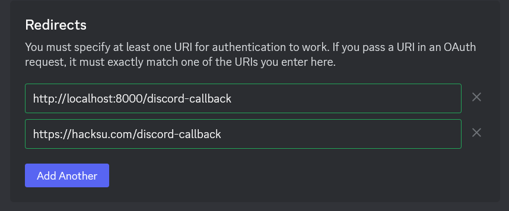

# The HacKSU Website

Note that you can edit some of the site's content without changing its source code. Go to https://hacksu.com/login to log in. If you have the "Leader" role in the HacKSU Discord, you'll be given access to the admin pages and be able to edit the meetings and leadership pages, etc.

## Guide to development

Install [Node.js](https://nodejs.org/en) and [yarn](https://yarnpkg.com/).

### Install dependencies

Run this before attempting to start the site:

```
yarn install
```

### The configuration file

In order for the site to work properly, a server.config.json file must be present in the root directory. An example configuration file is provided below:

```json
{
    "sendgrid": {
        "token": "sendgrid token goes here"
    },
    "session": {
        "secret": "session secret goes here"
    },
    "discord": {
        "clientID": "Discord client ID goes here",
        "clientSecret": "Discord client secret goes here"
    }
}
```

The session secret should be some random or otherwise arbitrary string.

The Sendgrid token should be an API key for a Sendgrid account but also it is not currently used anyway.

The Discord client ID and secret should correspond to some Discord application that has the ability to log users in to hacksu.com. You can create such an application by going to the [Discord developer portal](https://discord.com/developers/applications/), hitting "New Application", and adding redirects in the OAuth2 page like so:



Grab the client ID and secret from the OAuth2 page in the new application's settings and add them to the server.config.json file. Then, go to localhost:8000/login (which is the local development equivalent of https://hacksu.com/login) to initiate the login process using this Discord application. This setup allows leaders (with the "Leader" role in the HacKSU Discord server) to automatically authenticate themselves and make edits to the content on the site.

The Discord application whose client ID and secret are currently used in the server configuration on the live site belongs to me (Mitch) and will work unless I someday accidentally delete it.

### Run a server in debug mode with hot-reloading for development

```
yarn dev
```

Then go to the localhost URL that shows up in the browser console.

### Bundle for production

```
yarn build
```

This step uses [vite-ssg](https://github.com/antfu-collective/vite-ssg) to save the site's content as HTML. Keep this step in mind when developing the site; if you write code in a Vue component that directly accesses objects that are provided by a browser, like `window`, this step will crash, since this initial build is not run in a browser. You can usually move code that accesses browser-y stuff to a callback like `onMounted` to avoid this.

### Deploy your changes

When you push to the master branch of this repository, the Github action located in `.github/workflows/build_and_deploy.yml` will hopefully push all new changes to the actual web server that hosts the site.

### Note on stored data

The "db" folder stores JSON files that act as the database for the site's content. `entities.js` stores the schema for the objects that will be stored in these files. You should be able to update the database through the admin interface without needing to create or modify these files directly. However, if this site is migrated to another server, transferring the .json files and the pictures in `public/event-photos` and `public/staff-photos` from the old server to the new one is a good idea. (These things are not committed to GitHub or git, as they aren't part of the source code and change regularly.)
